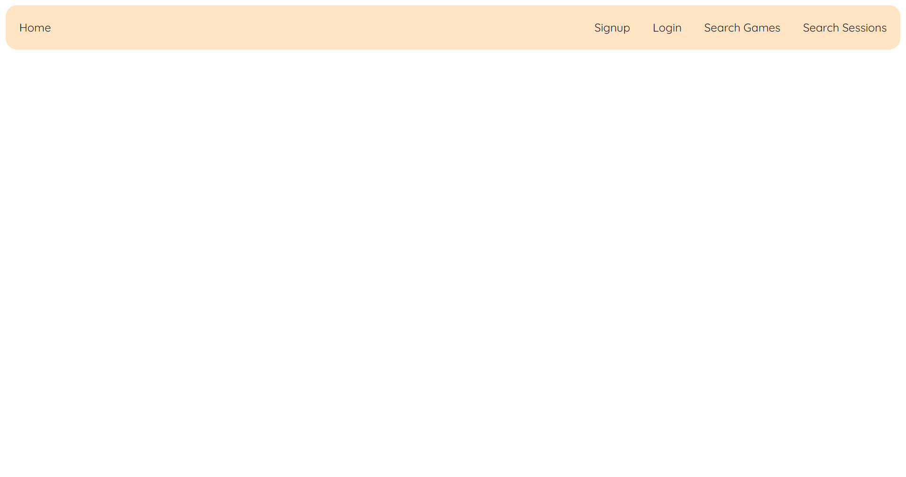

# Introduction
This document contains the relevant design and implementation aspects of an information system to manage multiplayer video game sessions.

The __domain__ of the system contains the ``Player``, ``Game`` and ``Session`` entities which are described as follows:

* A _player_ is characterized by a unique number, a unique name, a unique email, a unique password and a unique token.

* A _game_ is characterized by, a unique number, a unique name, the developer and a set of genres (e.g., RPG, Adventure, Shooter, Turn-Based, Action)

* A _session_ is characterized by a unique number, the number of players, the session date, the game, the session host and the associated players.

The __backend__ was developed with __Kotlin__ technology. To __handle/receive HTTP requests__, the [__HTTP4K__](https://www.http4k.org/) library was used. The __body serialization/deserialization__ was done using the [__kotlinx.serialization library__](https://kotlinlang.org/docs/serialization.html). The __data__ that are specific to the application is __stored__ in a __Postgresql database__.

The __frontend__ was developed with __HTML__, __CSS__ and __JavaScript__. The __DOM API__ was used to manipulate the __HTML elements__ and the __Fetch API__ was used to make __HTTP requests__ to the __API__.

The __application__ was hosted using [__Render__](https://render.com/), a example of a __Platform as a Service (PaaS)__ provider that allows to deploy and host applications.

## Modeling the database
### Conceptual model


#### Design Restrictions

* __Player Table__ has two __encoded__ attributes, `passwordHash` and `tokenHash`.

* `genres` attribute of __Game Table__ has to __guarantee__ that the array is __not empty__ and the __maximum size__ of it is __5__.

* __Session Table__'s `players` attribute __can't be empty__ and __can't overlap__ the value in the `capacity` attribute

### Physical Model


#### Design Aspects

__Game__ and __Session__ tables use __arrays__ to represent outside data, this design applies to the two models.

The __Game Table__ uses an array of integers to represent the __genres__ of a given Game. `Genres` is an __enum class__ that includes all the __accepted genres__ in the application. The integers in the array correspond to the __index__ of the genre in the __enum class__ (e.g. `genres { 3 }` = `TURNBASED`).

The __Session Table__ also uses an array of integers that correspond to the __ids__ of the __players__ associated to that __session__ (e.g. an array like the following `[3,9]` means that both players with ids 3 and 9 are associated to that session).

__Session Table__ has an attribute called __host__, this attribute has to be __equal__ to the __first element__ of the array of integers in __player__ attribute, the __player__ responsible for __creating the session__ is __equivalent__ to the __host__ and the __first player__ associated to that session, which means this __player__ will be the __first__ in the array.

## Software organization

### Open-API Specification
The YAML file for the current implementation is present [here](api.yml).

The __routes__ for the __API__ are shown below:

| Method | Route                         | Description                   | Authenticated |
|--------|-------------------------------|-------------------------------|---------------|
| GET    | ``/api/home/{token}``         | Get authenticated player home | No            |
| PATCH  | ``/api/login``                | Sign in player                | No            |
| PATCH  | ``/api/logout``               | Sign out player               | Yes           |
| POST   | ``/api/player``               | Create player                 | No            |
| GET    | ``/api/player/{id}``          | Get player info by id         | Yes           |
| POST   | ``/api/players/search``       | Search player by name         | No            |
|        |                               |                               |               |
|        |                               |                               |               |
| GET    | ``/api/game/{id}``            | Get game details by id        | No            |
| GET    | ``/api/games``                | Get games                     | No            |
| POST   | ``/api/game``                 | Create game                   | Yes           |
|        |                               |                               |               |
|        |                               |                               |               |
| POST   | ``/api/session``              | Create session                | Yes           |
| DELETE | ``/api/session/{id}``         | Delete session                | Yes           |
| PATCH  | ``/api/session/{id}/players`` | Add player to session         | Yes           |
| PATCH  | ``/api/session/{id}/player``  | Remove player from session    | Yes           |
| GET    | ``/api/session/info/{id}``    | Get session info by id        | No            |
| GET    | ``/api/session/search``       | Get sessions                  | No            |
| PATCH  | ``/api/session/{id}``         | Update session                | Yes           |

In our Open-API specification, we highlight the following aspects:

- Since we use a single object to define various __error responses__, a single schema was used (`ErrorResponse`).
This can represent everything from __Unauthorized__ from incorrect parameter types to other errors.
- Every request that responds with an object in the body has a schema, even if it's for a single
integer (for consistency’s sake).
- The method of authentication is represented in a __securitySchema__.
- After creating a player, a __token__ is generated and saved, __encoded__. However, this value is changed __multiple times__, according to player's __login__ and __logout__. On __logout__, the token used during player's authentication is __deleted__, and on __login__ a new token will be generated and linked to the __player intended to authenticate__, as a way of improving __security__.

### Request Details

#### __API__

When a client initiates an __HTTP request__ to the API, this request contains information such as the __HTTP method__ (__GET__, __POST__, __PUT__, __DELETE__), the __endpoint__ (URL), __headers__, and possibly a __request body__ with data.

The request will be received by the __API Server__, that is responsible to determine how it will be handled. Based on the __URL__ provided on the request, the server will __route__ the request to the appropriate __handler__, using the __AppApi Class__, the request will be forward to the Api Class that it corresponds to (`PlayerApi Class`, `GameApi Class`, `SessionApi Class`).

Some of the requests may need to __authenticate__ the client to ensure that it has __permission__ to access the requested resource. In the Api Classes the credentials will be verified, in this case, it will verify __Bearer Token__.

The verification of the credentials is done using the `AuthHandler Class`. This class has the `handle Middleware` responsible for checking the existence of __playerId__ in the __request header__. 

This `authenticate Method` obtains the __Bearer Token__ value, in order to check if the user is already authenticated, checking if its value is null or not. It tries to obtain __Bearer Token__ from the request using `getBearerToken Method`. Next, this method validates if the token already exists, using the `checkIfPlayerTokenExists Method` that checks the previous existence of the present token. Finally, after token validation, it will use the `getPlayerIdByToken Method` and returns the __player id__ associated to that __token__. If __Bearer Token__ is null, the user is __not authenticated__.

The `getBearerToken` is an auxiliary function, which obtains the __Bearer Token__ present in the __Authorization__ parameter of the __request header__.

```kotlin
class AuthHandler(private val services: PlayerServices) {

    val handle: Filter = Filter { next ->
        { request ->
            val playerId = authenticate(request)
            if (playerId != null) {
                next(request.header("playerId", playerId.toString()))
            } else {
                val exception = ApiException(PlayerNotLoggedInException.message.toString())
                Response(Status.UNAUTHORIZED).body(Json.encodeToString(exception))
            }
        }
    }

    fun authenticate(request: Request): Int? {
        val token = getBearerToken(request) ?: return null
        if (!services.checkIfPlayerTokenExists(token)) return null
        return services.getPlayerIdByToken(token)
    }

    private fun getBearerToken(request: Request): String? {
        val authHeader = request.header("Authorization") ?: return null
        return authHeader.split(" ").let {
            if (it.size != 2 || it[0].uppercase() != "BEARER") null
            else it[1]
        }
    }
}

// usage
routes(
    "/game" bind POST to authHandler.handle.then { req -> exceptionHandler { createGame(req) } }
)
```

#### __Services__

Once the request is __authenticated__, the API __processes__ it according to the implemented logic for the __specific endpoint__. This involves calling one of the __Service Classes__ to deal with the request __validation__ (`PlayerServices Class`, `GameServices Class`, `SessionServices Class`).

The __Service Classes__ are the ones who will __validate__ the request to ensure that it meets certain __criteria__ or __constraints__. This could involve __checking parameters__, validating the __request body__ against a __schema__, or ensuring that the client has provided all __required information__ (e.g. `checkPlayerName`, `checkId`, etc.).

#### __Data__

In order to __fulfill__ the request, after request validation it will be forward to either __DataMem Classes__ or __DataBaseMem__, depending if the server is using __local data__ or __data from a database__. In these classes, data required by the request will be __fetched__ or __added__ depending on the type of request.

#### __Response__

After processing the request, the API __generates__ a __response__ to send __back to the client__. This response includes an __HTTP status code__ indicating the __outcome__ of the request (e.g. `200` for `Success`, `404` for `Not Found`, `500` for `Server Internal Error`) and also includes a __response body__ with data or additional information. Before sending the response, the API __serializes__ the data into a format that can be __transmitted__ over the __network__ (e.g. `SessionDetailsOutputModel` data class, `CreatePlayerOutputModel` data class, etc).

Finally, the API sends the __response back to the client__ over the __network__. This involves packaging the response into an __HTTP response message__ and sending it back through the same __communication channel__ that the request came in on.


### Connection Management

Using an instance of the `PGSimpleDataSource` class, it's possible to connect to a database by via its __URL and authentication parameters__. In this implementation, the previously mentioned URL and authentication is fetched via an __environment variable__ and set to be used in the `PGSimpleDataSource` object.

To __establish a connection__ and __execute a query__, the `use` extension method is used. 

It's an __autocloseable__ method, which means it will execute the __lambda block and terminate the connection__.

__Per query__, a connection is established, the query is executed, and the connection is terminated.

### Data Access

In order to __access the data__, it was created the class `AppDataAccess` which depending on how it is instantiated, can be used to access __data in memory__ or in a __Postgresql__ __database__.

The `AppDataAccess` class is also responsible for __instantiating__ the __classes__ that are used to __access the data__ of __each entity__. 

The classes (`EntityNameDataBase` and `EntityNameDataMem`) __implement__ the __interface__ `EntiyNameDataAccess` that has the signature of the __methods__ to fullfill all the __required functionalities for that entity__ (e.g. `createPlayer`, `getGames`, `addPlayerToSession`, etc).

### Error Handling/Processing

Every __http handler__ in the application uses the `exceptionHandler` that catches any exception that is thrown by the http handler and returns an `ApiException` object in the __response body__.

```kotlin
@Serializable
class ApiException(val message: String) {
    companion object {
        val NOT_FOUND = listOf(
            SessionDoesntExistException,
            PlayerNotFoundException,
            GameNotFoundException
        )
        val BAD_REQUEST = listOf(
            InvalidPlayerNameException,
            InvalidEmailException,
            InvalidPasswordException,
            InvalidGameNameException,
            InvalidGameNameLengthException,
            InvalidDeveloperNameException,
            InvalidDeveloperNameLengthException,
            InvalidGenreException,
            InvalidBodyInputException,
            InvalidDateException,
            InvalidGameIdException,
            InvalidCapacityException,
            InvalidSessionIdException,
            InvalidPlayerIdException,
            InvalidStateException,
            SessionIsFullException,
            SessionHasPlayerException,
            SessionHasExpiredException,
            SessionHostCantBeRemovedException,
            PlayerAlreadyExistsException,
            PlayerNotInSessionException,
            GameAlreadyExistsException
        )
        val FORBIDDEN = listOf(
            PlayerNotTheSessionHostException
        )
        val UNAUTHORIZED = listOf(
            PlayerNotLoggedInException
        )
    }
}

fun exceptionHandler(apiHandler: () -> Response): Response {
    return try {
        apiHandler()
    } catch (e: Exception) {
        val status = when (e) {
            in ApiException.NOT_FOUND -> Status.NOT_FOUND
            in ApiException.BAD_REQUEST -> Status.BAD_REQUEST
            in ApiException.FORBIDDEN -> Status.FORBIDDEN
            in ApiException.UNAUTHORIZED -> Status.UNAUTHORIZED
            else -> Status.INTERNAL_SERVER_ERROR
        }
        val apiException = ApiException(e.message ?: "Internal Server Error")
        Response(status).body(Json.encodeToString(apiException)).header("content-type", "application/json")
    }
}

// usage
routes(
    "/player" bind Method.POST to { req -> exceptionHandler { createPlayer(req) } }
)

// response e.g.
{
    "message": "Player is not in the session"
}
```

## __Single Page Application (SPA)__

The current __Single Page Application (SPA)__ is designed to provide a __Web User Interface__ to interact with the __API__. 

To support that, it was added a ``ResourceLoader`` class to the __API routes__ to __load and serve__ the SPA files present in the ``static-content`` directory.

````kotlin
val routes = routes(
        ...,
        singlePageApp(ResourceLoader.Directory("static-content"))
)
````

To __simplify the creation__ of the __elements__ shown in the page, __functions__ were created to __replicate that behavior__ (__domain specific language__), e.g.:

````javascript
export function h1(text) {
    const h1 = document.createElement("h1")
    const textNode = document.createTextNode(text)
    h1.appendChild(textNode)
    return h1
}
````

The following __previews__ shows an example of an __authenticated__ player and an __unauthenticated__ player accessing the SPA:

<div align=center>




</div>

The __nodes` color__ of the following __navigation graph__ of the SPA have the following meanings:

* __Green__ nodes/arrows can only be accessed by __non-authenticated__ players;

* __Red__ nodes/arrows can only be accessed by __authenticated__ players;

* __Blue__ nodes/arrows can be accessed by __both__ __non-authenticated__ and __authenticated__ players.

<div align=center>


</div>

The ``NotFound`` page is shown when the user tries to access a page that __doesn't exist__, can be accessed by __both__ __non-authenticated__ and __authenticated__ players and always has the option to __go back__ to the __home page__ or the previous page accessed.

Here is an example of the __NotFound__ page:

<div align=center>


</div>

The __SPA__ can be accessed with the following __URL__: https://img-ls-2324-2-42d-g10.onrender.com/#home

## Critical Evaluation

In this fourth and last phase, we are able to everything that was proposed in the last phases. We have a fully functional __API__ that can handle __CRUD__ operations for the __game__, __player__ and __session__ entities. 

We also have a __SPA__ that can be used to __interact__ with the __API__.


Some future ideas that could be implemented to improve the application are:

* __Add__ the frontend functionalities to __update__ a player's information;

* __Add__ the frontend option to __search__ for a player by its __name__;

* __Add__ having a friend list, so the player can __invite__ friends to a session.